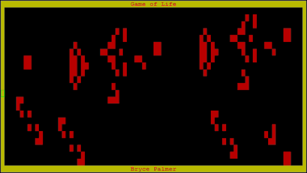

# bootkernel-game-of-life
Mini MBR Bootstrap and Kernel with Game of Life Implementation

## Run Instructions

On UNM CARC's Hopper cluster:

- `srun --pty  bash`

For convenience, a shell script has been provided to run the kernel:

- `bash run.sh`: Load the qemu module and run the program.
